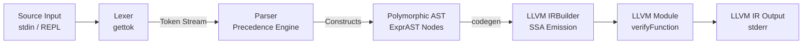

# Kaleidoscope: LLVM-Based Toy Language Compiler

[](https://en.wikipedia.org/wiki/C%2B%2B14)
[](https://llvm.org/)
[]()
[](LICENSE)

A modular, extensible C++ implementation of the **Kaleidoscope** programming language frontend and **LLVM Intermediate Representation (IR) Code Generator**, inspired by the official [LLVM Tutorial](https://llvm.org/docs/tutorial/MyFirstLanguageFrontend/index.html).

---

## 📑 Table of Contents
- [Overview](#-overview)
- [Key Features](#-key-features)
- [System Architecture](#-system-architecture)
- [Project Layout](#-project-layout)
- [How It Works: Compilation Stages](#-how-it-works-compilation-stages)
  - [1. Lexical Analysis (Scanner)](#1-lexical-analysis-scanner)
  - [2. Syntax Analysis & Operator Precedence Parsing](#2-syntax-analysis--operator-precedence-parsing)
  - [3. Abstract Syntax Tree (AST) Hierarchy](#3-abstract-syntax-tree-ast-hierarchy)
  - [4. Semantic Analysis & Symbol Scoping](#4-semantic-analysis--symbol-scoping)
  - [5. LLVM IR Code Generation](#5-llvm-ir-code-generation)
- [Building & Installation](#-building--installation)
  - [Linux / WSL (Ubuntu)](#linux--wsl-ubuntu)
  - [macOS](#macos)
- [Interactive Usage (REPL)](#-interactive-usage-repl)
- [Example Programs & IR Output](#-example-programs--ir-output)
- [Presentation & Visual Assets](#-presentation--visual-assets)
- [Roadmap & Future Extensions](#-roadmap--future-extensions)
- [References & Acknowledgements](#-references--acknowledgements)

---

## 🚀 Overview

**Kaleidoscope** is a procedural language designed to illustrate the internal mechanics of a modern compiler. This implementation breaks down the compiler into clear, decoupled modules across parsing, abstract syntax modeling, symbol scoping, and LLVM IR lowering.

The system reads expressions or function definitions interactively through a Read-Eval-Print Loop (REPL), verifies grammar rules and scoping constraints, and constructs verified LLVM SSA (Static Single Assignment) byte-code.

---

## ✨ Key Features

- **Custom Hand-Written Lexer**: High-performance character stream tokenizer handling keywords, identifiers, numeric literals, comments (`#`), and ASCII operators.
- **Recursive Descent & Operator Precedence Parser**: Implements operator-precedence climbing for binary math expressions (`<`, `+`, `-`, `*`).
- **Polymorphic AST**: Clean object-oriented design using modern C++ memory management (`std::unique_ptr`).
- **LLVM IR Code Generation**: Direct translation of AST nodes to LLVM 64-bit floating-point instructions using `llvm::IRBuilder<>`.
- **Foreign Function Interface (FFI)**: Support for C standard library bindings via `extern` declarations (e.g. `extern sin(x);`).
- **Function Integrity Verification**: Automatically runs LLVM's `llvm::verifyFunction` on all compiled units.

---

## 🏗 System Architecture



---

## 📁 Project Layout

```text
.
├── ast/                        # Abstract Syntax Tree hierarchy
│   ├── ExprAST.h               # Base expression interface
│   ├── NumberExprAST.h/.cpp    # Numeric constant nodes (e.g., 42.0)
│   ├── VariableExprAST.h/.cpp  # Identifier and argument reference nodes
│   ├── BinaryExprAST.h/.cpp    # Binary operator nodes (LHS op RHS)
│   ├── CallExprAST.h/.cpp      # Function call invocation nodes
│   ├── PrototypeAST.h/.cpp     # Function signature & parameter list
│   └── FunctionAST.h/.cpp      # Function definition & body container
├── kaleidoscope/               # LLVM global state & builder bindings
│   ├── kaleidoscope.h
│   └── kaleidoscope.cpp
├── lexer/                      # Lexical analysis & token stream
│   ├── token.h                 # Token enumeration definitions
│   ├── lexer.h                 # Lexer public interface
│   └── lexer.cpp               # Scanner implementation
├── logger/                     # Diagnostic & error logging helpers
│   ├── logger.h
│   └── logger.cpp
├── parser/                     # Syntax analysis & precedence climber
│   ├── parser.h
│   └── parser.cpp
├── main.cpp                    # Driver entry point & REPL loop
├── Makefile                    # Build automation script
├── presentation.html           # Interactive 16:9 Presentation slide deck
├── Kaleidoscope_Compiler_Presentation.pdf # Exported PDF presentation
└── README.md                   # Project documentation
```

---

## 🔬 How It Works: Compilation Stages

### 1. Lexical Analysis (Scanner)
Located in `lexer/lexer.cpp`, the scanner processes raw characters from standard input:
- Skips whitespace using `isspace()`.
- Recognizes language keywords (`def`, `extern`) and identifiers into `IdentifierStr`.
- Parses numbers into 64-bit `double` (`NumVal`) via `strtod()`.
- Strips single-line comments starting with `#`.

### 2. Syntax Analysis & Operator Precedence Parsing
Located in `parser/parser.cpp`, expressions are parsed using an operator precedence table:

| Operator | Precedence Level | Associativity |
| :---: | :---: | :---: |
| `<` | `10` | Left-to-Right |
| `+`, `-` | `20` | Left-to-Right |
| `*` | `40` | Left-to-Right |

Expressions like `a + b * c` are correctly grouped as `a + (b * c)` before IR emission.

### 3. Abstract Syntax Tree (AST) Hierarchy
All syntax constructs derive from `ExprAST`:
- Every AST class implements `virtual llvm::Value *codegen() = 0;`
- Manages memory through smart pointers (`std::unique_ptr<ExprAST>`).

### 4. Semantic Analysis & Symbol Scoping
- **Symbol Table (`NamedValues`)**: Maps variable names to their corresponding active `llvm::Value*` within the current function scope.
- **Type Checking**: All values are unified to 64-bit double-precision floats (`llvm::Type::getDoubleTy(TheContext)`). Comparisons evaluate to booleans and are explicitly zero-extended and cast to floating-point values via `CreateUIToFP`.

### 5. LLVM IR Code Generation
- Emits clean SSA instructions (`fadd`, `fsub`, `fmul`, `fcmp`, `call`, `ret`).
- Verifies structural integrity with `llvm::verifyFunction(*TheFunction)`.

---

## 💻 Building & Installation

### Linux / WSL (Ubuntu)

```bash
# 1. Install LLVM development packages and tools
sudo apt update
sudo apt install -y llvm-dev clang make g++

# 2. Build the executable
make

# 3. Launch the compiler REPL
./main
```

### macOS

```bash
# 1. Install LLVM via Homebrew
brew install llvm

# 2. Compile
make

# 3. Launch REPL
./main
```

---

## 🎮 Interactive Usage (REPL)

Upon launching `./main`, you will be greeted by the `ready>` prompt:

```text
ready> def square(x) x * x;
Read function definition:
define double @square(double %x) {
entry:
  %multmp = fmul double %x, %x
  ret double %multmp
}

ready> 4 + 5 * 2;
Read top-level expression:
define double @__anon_expr() {
entry:
  %multmp = fmul double 5.000000e+00, 2.000000e+00
  %addtmp = fadd double 4.000000e+00, %multmp
  ret double %addtmp
}
```

Press `Ctrl + D` (or `EOF`) to exit. The compiler will output the complete generated LLVM Module.

---

## 🧪 Example Programs & IR Output

### Function Definitions & Calls
```kaleidoscope
def average(a b) (a + b) * 0.5;
```
**Generated LLVM IR:**
```llvm
define double @average(double %a, double %b) {
entry:
  %addtmp = fadd double %a, %b
  %multmp = fmul double %addtmp, 5.000000e-01
  ret double %multmp
}
```

### Foreign Function Declarations (FFI)
```kaleidoscope
extern sin(x);
extern cos(x);

def trig_identity(x) sin(x) * sin(x) + cos(x) * cos(x);
```
**Generated LLVM IR:**
```llvm
declare double @sin(double)
declare double @cos(double)

define double @trig_identity(double %x) {
entry:
  %calltmp = call double @sin(double %x)
  %calltmp1 = call double @sin(double %x)
  %multmp = fmul double %calltmp, %calltmp1
  %calltmp2 = call double @cos(double %x)
  %calltmp3 = call double @cos(double %x)
  %multmp4 = fmul double %calltmp2, %calltmp3
  %addtmp = fadd double %multmp, %multmp4
  ret double %addtmp
}
```

---

## 📊 Presentation & Visual Assets

This repository includes a 12-slide presentation covering the compiler's architecture, flowcharts, AST design, and work plan:

- 📄 **PDF Slide Deck**: [`Kaleidoscope_Compiler_Presentation.pdf`](Kaleidoscope_Compiler_Presentation.pdf)
- 🌐 **Interactive Web Deck**: [`presentation.html`](presentation.html)

---

## 🗺 Roadmap & Future Extensions

- [ ] **Phase 1: JIT Engine & Optimization Passes**
  - Integrate `llvm::orc::LLJIT` for real-time in-memory expression evaluation.
  - Attach `llvm::FunctionPassManager` with instruction combination and dead code elimination passes.
- [ ] **Phase 2: Control Flow & Memory**
  - Implement `IfExprAST` and phi-node branches for `if/then/else`.
  - Add `ForExprAST` loop construct.
  - Implement mutable variables using stack allocation (`alloca`) and `mem2reg`.
- [ ] **Phase 3: Native Compilation & Tooling**
  - Cross-compilation to native object files (`.o` / `.obj`).
  - Add DWARF / CodeView debug metadata.

---

## 📚 References & Acknowledgements

- [LLVM Tutorial: My First Language Frontend](https://llvm.org/docs/tutorial/MyFirstLanguageFrontend/index.html)
- [LLVM Programmer's Manual](https://llvm.org/docs/ProgrammersManual.html)
- [LLVM Doxygen Documentation](https://llvm.org/doxygen/)
